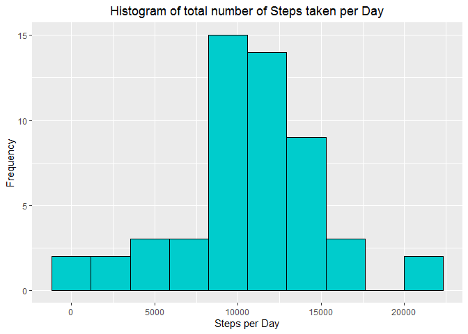
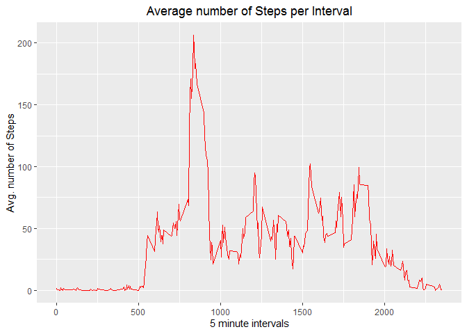
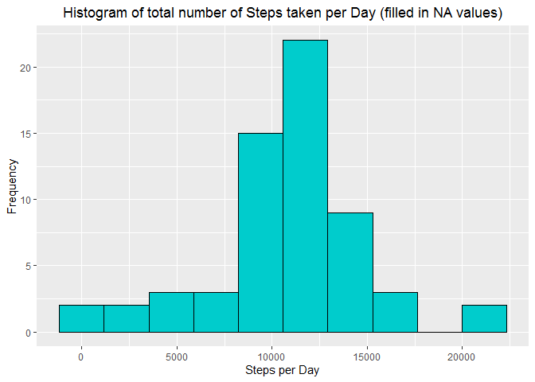
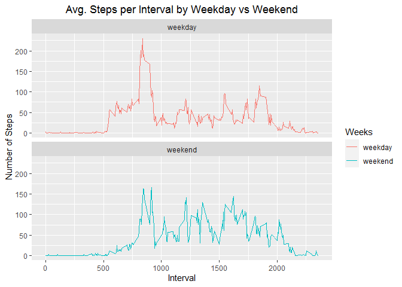

Loading the necessary external package to do the analysis according to the route of this project. If the packages is not installed, it can be install by `install.packages()`. In this case **ggplot2** is installed and loaded for plotting charts.  


```r
# install.packages("ggplot2")
library(ggplot2)
```

## Loading and preprocessing the data
- Downloading and unzipping the dataset into data folder.


```r
if(!file.exists("./data")) {
    dir.create("./data")
    fileUrl <- "https://d396qusza40orc.cloudfront.net/repdata%2Fdata%2Factivity.zip"
    download.file(fileUrl, destfile = "./data/dataFile.zip") # For windows operating system method="curl" has been eliminated
    unzip("./data/dataFile.zip", exdir = "./data")
}
```

- Loading the data into a data frame called `df`


```r
df <- read.csv("./data/activity.csv")
```

- It could be seen by using `str()`, what the data frame looks like.


```r
str(df)
```

```
## 'data.frame':	17568 obs. of  3 variables:
##  $ steps   : int  NA NA NA NA NA NA NA NA NA NA ...
##  $ date    : chr  "2012-10-01" "2012-10-01" "2012-10-01" "2012-10-01" ...
##  $ interval: int  0 5 10 15 20 25 30 35 40 45 ...
```

So it is a **17568x3** dimension data frame with some **NA** values in **steps** variable.

## What is mean total number of steps taken per day?
- Subsetting the data frame by steps taken per day with `aggregate()` function.


```r
steps_per_day <- aggregate(steps ~ date, data=df, FUN = sum, na.rm = TRUE)
head(steps_per_day)
```

```
##         date steps
## 1 2012-10-02   126
## 2 2012-10-03 11352
## 3 2012-10-04 12116
## 4 2012-10-05 13294
## 5 2012-10-06 15420
## 6 2012-10-07 11015
```

- A **Histogram** showing the number of steps taken per day ignoring the **NA** values. The chart bins represent the steps per day by `bins = 10` and gives a visual of distribution of result set.


```r
ggplot(steps_per_day, aes(x = steps)) + 
    geom_histogram(fill = rgb(0, 0.8, 0.8), color = "black", size = 0.5, bins = 10) +
    labs(title = "Histogram of total number of Steps taken per Day", x = "Steps per Day", y = "Frequency") +
    theme(plot.title = element_text(hjust = 0.5))
```

<!-- -->

- Calculating the **mean** of the *total number of steps taken per day*


```r
mean_steps = mean(steps_per_day$steps)
mean_steps
```

```
## [1] 10766.19
```

- Calculating the **median** of the *total number of steps taken per day*


```r
median_steps = median(steps_per_day$steps)
median_steps
```

```
## [1] 10765
```

So the **mean** and **median** of *total number of steps taken per day* are 1.0766189\times 10^{4} and 10765.

## What is the average daily activity pattern?
- Subsetting the data frame by average number of steps taken per 5-minute interval with `aggregate()` function.


```r
avg_steps_per_interval <- aggregate(steps ~ interval, data=df, FUN = mean, na.rm = TRUE)
head(avg_steps_per_interval)
```

```
##   interval     steps
## 1        0 1.7169811
## 2        5 0.3396226
## 3       10 0.1320755
## 4       15 0.1509434
## 5       20 0.0754717
## 6       25 2.0943396
```

- **A time Series Plot** showing the average number of steps taken per 5-minute interval which is averaged across all days. The time series figure is a visual representation of distribution of result set which is the average number of steps per 5-minute interval.


```r
ggplot(avg_steps_per_interval, aes(x = interval, y = steps)) +
        geom_line(color = "red", size = 0.5) +
        labs(title = "Average number of Steps per Interval", x = "5 minute intervals", y = "Avg. number of Steps") +
        theme(plot.title = element_text(hjust = 0.5))
```

<!-- -->

- Finding the **index** of *average number of steps* that is **maximum** per *5-minute interval*.


```r
max_idx <- which.max(avg_steps_per_interval$steps)
max_idx
```

```
## [1] 104
```

- Calculating the **5-minute interval** that contains the **maximum average number of steps**.


```r
avg_steps_per_interval[max_idx, 1]
```

```
## [1] 835
```

So the **5-minute interval** that contains the **maximum average number of steps** is **835** and the maximum average number of steps is **206.1698113**.

## Imputing missing values
At the beginning its being observed that there are some **missing values** coded as **NA** in *steps* variable within the dataset. The presence of missing values in a dataset sometimes may introduce bias into some calculations.

- Calculating the number of **missing values** in the *steps* variable coded as **NA** within the data frame.


```r
sum(is.na(df$steps))
```

```
## [1] 2304
```

- Creating a copy of original data frame to be filled in missing values


```r
df_copy <- df
```

The **strategy** for filling the missing values in steps variable taken here is to take the mean value of steps per 5-minute interval and substitute it with the corresponding missing value according to the 5-minute interval into the data frame. The average e(mean) steps per 5-minute interval have already been calculated previously.

- Finding the indexes corresponding to missing values (**NA**).


```r
na_idx = which(is.na(df_copy$steps))
```

- Finding the corresponding 5-minute interval value where the steps variable have missing values.


```r
na_interval = df_copy[na_idx, 3]
```

- Storing the mean values of average steps per 5-minute interval where there is missing values in the steps variable using `sapply()` function.


```r
fill_na = sapply(na_interval, function(x){
    avg_steps_per_interval[(avg_steps_per_interval$interval == x), 2]
})
```

- Replacing the missing values with the corresponding mean value of average steps per 5-minute interval by using the indexes of missing values.


```r
df_copy[na_idx, 1] = fill_na
```

- Subsetting the data frame by steps taken per day with `aggregate()` function but now with the missing values filled in.


```r
naFill_steps_day <- aggregate(steps ~ date, data=df_copy, FUN = sum)
head(naFill_steps_day)
```

```
##         date    steps
## 1 2012-10-01 10766.19
## 2 2012-10-02   126.00
## 3 2012-10-03 11352.00
## 4 2012-10-04 12116.00
## 5 2012-10-05 13294.00
## 6 2012-10-06 15420.00
```

- Now a new **Histogram** filled in **NA** values showing the number of steps taken per day. The chart bins represent the steps per day by `bins = 10` and gives a visual of distribution of result set.


```r
ggplot(naFill_steps_day, aes(x = steps)) + 
    geom_histogram(fill = rgb(0, 0.8, 0.8), color = "black", size = 0.5, bins = 10) +
    labs(title = "Histogram of total number of Steps taken per Day (filled in NA values)", x = "Steps per Day", y = "Frequency") +
    theme(plot.title = element_text(hjust = 0.5))
```

<!-- -->

- Calculating the **mean** of the *total number of steps taken per day* for new data frame filled in **NA** values.


```r
naFill_mean_steps = mean(naFill_steps_day$steps)
naFill_mean_steps
```

```
## [1] 10766.19
```

- Calculating the **median** of the *total number of steps taken per day* for new data frame filled in **NA** values.


```r
naFill_median_steps = median(naFill_steps_day$steps)
naFill_median_steps
```

```
## [1] 10766.19
```

So the **mean** and **median** of *total number of steps taken per day* for new data frame filled in **NA** values are 1.0766189\times 10^{4} and 1.0766189\times 10^{4}.  
The **mean** for new data frame is 1.0766189\times 10^{4} which is same as the **mean** of the original data frame. The **median** 1.0766189\times 10^{4} is only slightly shifted from the original data frame which was 10765.

## Are there differences in activity patterns between weekdays and weekends?
- Converting and formatting **date** variable *character* type to *Date* type in order to perform calculation.


```r
df_copy$date = as.Date(df_copy$date, "%Y-%m-%d")
```

- Creating a new factor variable in the data frame `df_copy` (filled-in missing values) with two levels “weekday” and “weekend” indicating whether a given date is a weekday or weekend day using `factor()` and `sapply()` function.


```r
df_copy["Weeks"] = factor(sapply(df_copy$date, function(x) {
    if (weekdays(x) != "Sunday" & weekdays(x) != "Saturday") 
    {
        "weekday"
    } else 
    {
        "weekend"
    }
}))
```

- Subsetting the data frame by steps taken per 5-minute interval in association with factor variable Weeks using `aggregate()` function.


```r
weeks_avg = aggregate(steps ~ interval + Weeks, data = df_copy, FUN = mean)
head(weeks_avg)
```

```
##   interval   Weeks      steps
## 1        0 weekday 2.25115304
## 2        5 weekday 0.44528302
## 3       10 weekday 0.17316562
## 4       15 weekday 0.19790356
## 5       20 weekday 0.09895178
## 6       25 weekday 1.59035639
```

- **A panel of two Time Series Plot** showing the average number of steps taken per 5-minute interval which is averaged across all weekday and weekend days. 


```r
ggplot(weeks_avg, aes(x = interval, y = steps, color = Weeks)) + 
    geom_line() + facet_wrap(. ~ Weeks, ncol = 1) +
    labs(title = "Avg. Steps per Interval by Weekday vs Weekend", x = "Interval", y = "Number of Steps") +
    theme(plot.title = element_text(hjust = 0.5))
```

<!-- -->

In summary, from the figure above it can be seen that there are some differences between the weekday and weekend profiles.

- In the weekend curve there are delayed upward trends which perhaps could be the reason of late wake up time as its being weekend.
- Overall there are higher degree of upward trends during the weekend than weekday.
- Though there is a pick in weekday which could be reason for morning walk, jogging or office hours.
- There are also more upward trends at the end of the day in weekend.
